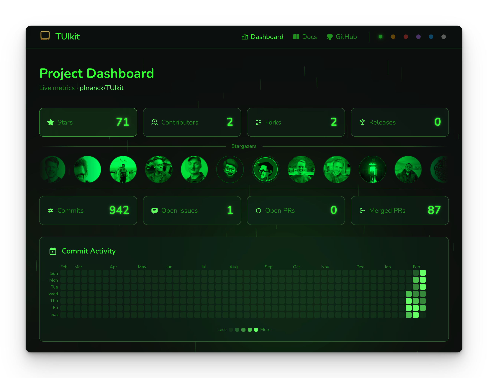

# TUIkit.dev

> Official landing page and live dashboard for **TUIkit** — the Swift Terminal UI framework

**[🌐 Live Site](https://tuikit.dev)** • **[📦 TUIkit Repository](https://github.com/phranck/TUIkit)** • **[📖 Documentation](https://docs.tuikit.dev)**

## About TUIkit

TUIkit is a declarative, SwiftUI-like framework for building Terminal User Interfaces in pure Swift. It runs on macOS and Linux with no ncurses or C dependencies. Learn more at [github.com/phranck/TUIkit](https://github.com/phranck/TUIkit).

## About This Site

This repository powers [tuikit.dev](https://tuikit.dev), featuring:

- **Hero page** with an animated CRT terminal boot sequence
- **Live dashboard** displaying real-time GitHub metrics, activity heatmaps, and contributor stats
- **Six terminal-inspired color themes** (green, amber, red, violet, blue, white)
- **Responsive design** optimized for mobile and desktop

## Features

- **🖥️ CRT Terminal Animation** – Realistic boot sequence with synchronized audio (Howler.js), parsed from `terminal-script.md`
- **📊 Live GitHub Dashboard** – Fetches stats from ~13 GitHub API endpoints with intelligent caching (5-min TTL)
- **🎨 Six Terminal Themes** – Classic green phosphor, amber, red alert, violet, blue VFD, and white paper
- **⚡ Static Site + Hydration** – Astro handles SSG, React powers interactive components with selective hydration

## Tech Stack

- **[Astro 5.10.3](https://astro.build)** – Static site generator with component islands architecture
- **[React 19.2.3](https://react.dev)** – Client-side interactivity (hydrated with `client:load`, `client:idle`, `client:visible`)
- **[TypeScript 5](https://www.typescriptlang.org)** – Strict mode throughout
- **[Tailwind CSS v4](https://tailwindcss.com)** – Utility-first styling with custom theme system
- **[Howler.js](https://howlerjs.com)** – Lazy-loaded audio for terminal boot sequence
- **[Node.js 22](https://nodejs.org)** – Build environment

## Getting Started

### Prerequisites

- **Node.js 22** (matches CI environment)
- **npm** (comes with Node.js)

### Installation

1. Clone the repository:
   ```bash
   git clone https://github.com/phranck/tuikit.dev.git
   cd tuikit.dev
   ```

2. Install dependencies:
   ```bash
   npm install
   ```

3. Start the dev server:
   ```bash
   npm run dev
   ```

4. Open [http://localhost:4321](http://localhost:4321) in your browser.

### Environment Variables (Optional)

For the dashboard to fetch live GitHub stats, create a `.env` file:

```env
PUBLIC_GITHUB_TOKEN=your_github_token_here
```

> The site works without a token, but you'll hit rate limits quickly. Get a token at [github.com/settings/tokens](https://github.com/settings/tokens).

## Available Commands

| Command | Description |
|---------|-------------|
| `npm run dev` | Start local development server (port 4321) |
| `npm run build` | Production build (runs prebuild scripts automatically) |
| `npm run preview` | Preview production build locally |
| `npm run update:plans` | Manually update project plans data |
| `tsx scripts/update-social-cache.ts` | Update social profiles cache |
| `tsx scripts/update-social-cache.ts --full` | Full refresh of social cache (weekly) |

## Project Structure

```
tuikit.dev/
├── src/
│   ├── components/
│   │   ├── astro/          # Static components (no JS shipped)
│   │   └── react/          # Interactive components (hydrated)
│   │       └── dashboard/  # Dashboard-specific React components
│   ├── hooks/              # React hooks (useGitHubStats, caching, clipboard)
│   ├── layouts/            # BaseLayout.astro (HTML shell, SEO, analytics)
│   ├── lib/                # Utilities (terminal-parser.ts)
│   ├── pages/              # Routes: index.astro (/), dashboard.astro (/dashboard)
│   └── styles/             # global.css (Tailwind + 6 theme palettes)
├── scripts/                # Build-time data generation
│   ├── generate-terminal-data.ts   # Parses terminal-script.md → terminal-data.ts
│   ├── update-plans-data.ts        # Fetches project plans from GitHub
│   └── update-social-cache.ts      # Updates social profiles cache
├── public/                 # Static assets, cached JSON, sounds, fonts
├── .github/workflows/      # CI/CD automation (4 workflows)
└── terminal-script.md      # Source file for hero terminal animation
```

## Key Architecture

- **Rendering Model**: Astro pages handle SSG and SEO, React components handle interactivity (hydration directives: `client:load`, `client:idle`, `client:visible`)
- **Terminal Animation Pipeline**: `terminal-script.md` → parsed by `src/lib/terminal-parser.ts` → prebuild script generates `src/components/react/terminal-data.ts` → consumed by `HeroTerminal.tsx`
- **Theme System**: Six CSS custom property palettes defined in `global.css`, stored on `<html data-theme="...">`, managed by React Context with localStorage persistence
- **Data Fetching**: Build-time scripts fetch GitHub API data; client-side `useGitHubStatsCache` hook wraps API calls with 5-min TTL localStorage caching
- **Prebuild Pipeline**: `npm run build` automatically runs `generate-terminal-data.ts` and `update-plans-data.ts` before Astro builds

## CI/CD Workflows

This project uses four GitHub Actions workflows:

- **`ci.yml`** – Build and deploy to GitHub Pages on push to `main`
- **`update-social-cache.yml`** – Fetch social profiles every 2h (incremental) + weekly full refresh
- **`update-weekly-activity.yml`** – Update activity heatmap data
- **`update-plans-data.yml`** – Update project plans data

All workflows use `[skip ci]` in auto-commit messages to prevent rebuild loops.

## Environment Variables

| Variable | Purpose | Required? |
|----------|---------|-----------|
| `PUBLIC_GITHUB_TOKEN` | GitHub API token for dashboard (higher rate limits) | Optional (but recommended) |
| `PUBLIC_TUIKIT_VERSION` | Injected by CI from GitHub tags | Auto-injected by CI |
| `PUBLIC_TUIKIT_TEST_COUNT` | Test count badge data | Auto-injected by prebuild |
| `PUBLIC_TUIKIT_SUITE_COUNT` | Test suite count | Auto-injected by prebuild |

## Contributing

Contributions are welcome! This is a companion site to the main [TUIkit framework](https://github.com/phranck/TUIkit).

- For framework issues/PRs, use the main TUIkit repository
- For landing page bugs/improvements, open an issue or PR here
